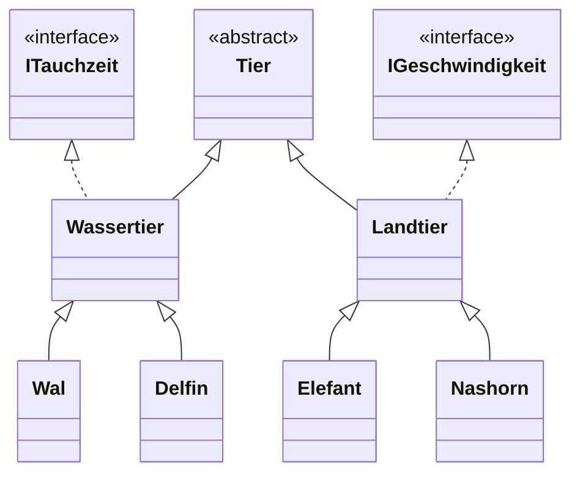
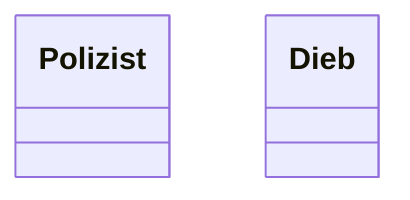
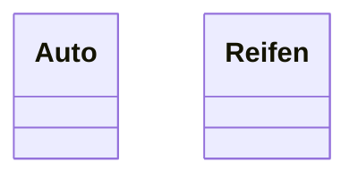
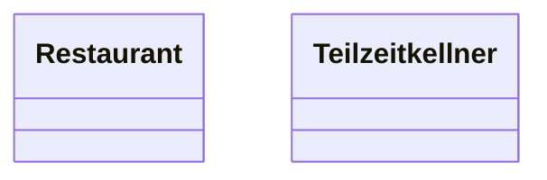
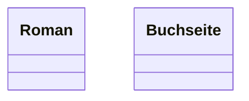
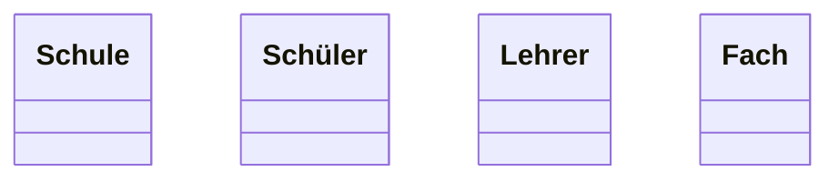
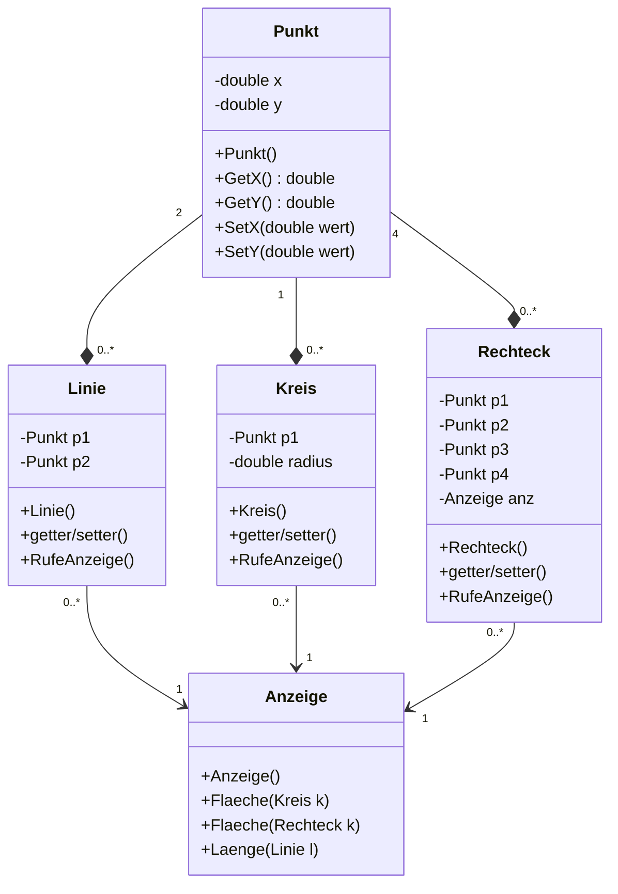

# Aufgaben 

## 3. Aufgaben zur Ein- und Ausgabe unter C#

### 3.1 


Es ist das Endkapital einer Spareinlage zu berechnen. Dazu sollen das Startkapital und der Zinssatz über die Tastatur
eingegeben werden. Die Anlage läuft immer drei Jahre. Beachten Sie den Zinseszinseffekt. Anschließend soll das
Endkapital ausgegeben werden. Wählen Sie für die Variablen geeignete Datentypen.

Beispiel:

- Startkapitel: 1000 (Euro)
- Zinssatz: 5 (Prozent)
- Endkapital: 1157.625 (Euro nach drei Jahren)

### 3.2

Schreiben Sie das folgende Wort auf den Bildschirm, ohne einen einzigen Buchstaben zu verwenden:

`ABBA`

### 3.3

Ausgangssituation:

In einem Unternehmen werden Produkte hergestellt. Das Unternehmen hat für die Produktion fixe Kosten von X Euro
und für jedes Produkt werden Y Euro Produktionskosten eingeplant. Man rechnet mit einem Erlös von Z Euro für ein
Produkt.

Aufgabenstellung:

Schreiben Sie ein C#-Programm, welches die Angaben der fixen Kosten, die Kosten  und den Erlös für ein Produkt 
einliest. Anschließend soll für eine eingegebene Produktionsmenge der Gewinn berechnet werden Nach dem Starten 
könnte das Programm so aussehen:

```bash
Gewinnberechnung Version 1.0
Bitte Geben Sie die fixen Kosten ein:
2500
Bitte Geben sie Kosten fuer ein Produkt ein:
125
Bitte Geben Sie den Erloes fuer ein Produkt ein:
159
Wie viele Produkte sollen hergestellt werden:
100

Der Gewinn betraegt: 900 Euro!
```

### 3.4

Schreiben sie ein C# Programm das lineare Gleichungen lösen kann. Dazu soll der Benutzer Werte für a und b
eingeben. Das Programm berechnet dann die Lösung. Allgemeine Formel einer linearen Gleichung. ax + b = 0

Nach dem Starten könnte das Programm so aussehen:

```bash
Lineare Gleichung Version 1.0

Bitte den Wert fuer a:
3
Bitte den Wert fuer b:
-6

Die Loesung lautet: 2
```

## 4. Aufgaben zu Operatoren in C#

### 4.1

Bestimmen Sie den Wert der Variablen x. Es gelten jeweils die folgenden Voraussetzungen:

```bash
int a = 10;
int b = 20;
int x;

x = 3 * (a + b) - b / 8;
x = (a++) + (++b);

a = 10;
b = 20;
x = (a % b) % (b % (++a));
```

### 4.2

Schreiben Sie ein C#-Programm, das zwei Integer-Zahlen über die Tastatur einliest und anschließend den Rest der
Division auf dem Bildschirm ausgibt. Schreiben Sie das Programm, ohne den Modulo-Operator zu benutzen.

### 4.3

Schreiben Sie ein C#-Programm, das eine Integer-Zahl einliest. Anschließend soll die Zahl mit 2, 4 und 32 multipliziert
werden, ohne den Multiplikationsoperator zu benutzen.

Nach dem Starten könnte das Programm so aussehen:

```bash
Bitte eine Zahl eingeben:
5

5 * 2 = 10
5 * 4 = 20
5 * 32 = 160
```

### 4.4

In der Netzwerktechnik wird das Subnetting dazu benutzt innerhalb einer Netzklasse weitere Teilnetze zu bilden. Dabei
werden IP-Adressen mit einer so genannten Maske (Subnet-Mask) verknüpft und als Ergebnis erhält man eine
Netzadresse. Ist diese Netzadresse bei zwei IP-Adressen gleich, so gehören die beiden IP-Adressen zum gleichen
Teilnetz (Subnet).

Beispiel:
```bash
IP-Adresse 1: 192.168.1.23
IP-Adresse 2: 192.168.1.34
Subnet-Mask: 255.255.255.0
```
Die einzelnen Komponenten der IP-Adressen werden nun durch den bitweisen UND-Operator & mit der Subnet-Mask
verknüpft.

Das Ergebnis ist dann die Netzadresse.
```bash
IP-Adresse 1: 192.168.1.23
&&
Subnet-Mask: 255.255.255.0
--------------------------
Netzadresse 1: 192.168.1.0
```

```bash
IP-Adresse 2: 192.168.1.34
&&
Subnet-Mask: 255.255.255.0
--------------------------
Netzadresse 2: 192.168.1.0
```

Schreiben Sie ein C#-Programm, welches zwei IP-Adressen (jeweils vier Integer-Variablen) und eine Subnet-Mask über
die Tastatur einliest und anschließend die Netzadressen auf dem Bildschirm ausgibt.

Nach dem Starten könnte es dann so aussehen:

```bash
Subnetting Version 1.0

Bitte die 1. IP-Adresse eingeben:
192
168
1
23

Bitte die 2. IP-Adresse eingeben:
192
168
1
34

Bitte die Subnet-Mask eingeben:
255
255
255
0

Die 1. Netzadresse lautet:
192.168.1.0

Die 2. Netzadresse lautet:
192.168.1.0
```

## 5. Aufgaben zur Selektion und Iteration

### 5.1

Schreiben Sie ein C#-Programm, das folgende Funktionalität hat:

Es sollen drei Zahlen (Datentyp float | single) über die Tastatur eingelesen werden.
Anschließend sollen das Minimum und das Maximum der Zahlen auf dem Bildschirm angezeigt werden.

Beispiel einer Bildschirmausgabe:

```bash
Bitte geben Sie den ersten Wert ein: 5
Bitte geben Sie den zweiten Wert ein: 33
Bitte geben Sie den dritten Wert ein: 22
Maximum: 33
Minimum: 5
```

Zusatz: Benutzen Sie bei der Umsetzung genau drei
if Anweisungen (ohne else).

### 5.2

Entwickeln Sie ein C#-Programm, das überprüft, ob ein eingegebenes Datum korrekt ist. Die Eingabe des Datums
erfolgt in Tag, Monat und Jahr, wobei die Werte in drei Integer-Variablen gespeichert werden sollen:

Beispiele:

- 10 5 2005 ist ein korrektes Datum
- 15 13 2001 ist kein korrektes Datum
- 29 2 2000 ist ein korrektes Datum (Schaltjahr)

Das Programm soll weiterhin in der Lage sein, die Besonderheit eines Schaltjahres in die Überprüfung einzubeziehen
(bei einem Schaltjahr hat der Februar 29 Tage).

> Tipp:
>
>Ein Jahr ist genau dann ein Schaltjahr, wenn
>- es durch 4, aber nicht durch 100 teilbar ist.
>- es durch 4, durch 100 und durch 400 teilbar ist.

Nach dem Starten könnte die Bildschirmausgabe so aussehen:

```bash
Bitte das Jahr eingeben:
2016
Bitte den Monat eingeben:
2
Bitte den Tag eingeben:
29
Dieses Datum ist korrekt
```

### 5.3

Analysieren Sie die folgenden for-Schleifen.
Bestimmen Sie den Wert von k nach dem Beenden der Schleife.

```csharp
int i, j, k;
k = 0;
for (i = 1; i < 10; i++) k += i;
Console.WriteLine("Wert von k: " + k);

k = 0;
for (i = 2; i < 10; i += 2) k += i;
Console.WriteLine("Wert von k: " + k);

k = 0;
for (i = 1, j = 5; (i < 5) && (j > 1); i++, j--) k += i * j;
Console.WriteLine("Wert von k: " + k);

k = 0;
for (i = 1; i < 5; i++)
{
    if (i == 3) continue;
    k += i;
}

Console.WriteLine("Wert von k: " + k);

k = 0;
for (i = 1; i < 10; i++)
{
    k += i;
    if (i == 6) break;
}

Console.WriteLine("Wert von k: " + k);
```

### 5.4

Versuchen Sie mit genau zwei for-Schleifen die folgende Bildschirmausgabe zu erreichen.

```bash
10 9 8 7 6 5 4 3 2 1 0
9 8 7 6 5 4 3 2 1 0
8 7 6 5 4 3 2 1 0
7 6 5 4 3 2 1 0
6 5 4 3 2 1 0
5 4 3 2 1 0
4 3 2 1 0
3 2 1 0
2 1 0
1 0
0
```

### 5.5

Benutzen Sie die for-Schleife, um die folgenden Probleme zu lösen:

- Es soll eine Integer-Zahl von der Tastatur eingelesen und anschließend sollen alle natürlichen Zahlen bis zu
  dieser Zahl auf dem Bildschirm ausgegeben werden.

Beispiel:
```bash
Eingabe: 8

Ausgabe: 1, 2, 3, 4, 5, 6, 7, 8
```

- Es soll eine Integer-Zahl von der Tastatur eingelesen und anschließend sollen alle geraden natürlichen Zahlen
  von dieser Zahl beginnend bis zur Zahl 2 ausgeben werden.

Beispiel:

```bash
Eingabe: 12

Ausgabe: 12, 10, 8, 6, 4, 2
```
- Schreiben Sie ein Programm, welches von 1 bis 10 zählt und sofort wieder herunterzählt. Das Programm darf nur
  for-Schleife benutzen.

Beispiel:

```bash
Eingabe: 12

Ausgabe: 1, 2, 3, 4, 5, 6, 7, 8, 9, 10, 9, 8, 7, 6, 5, 4, 3, 2, 1
```

### 5.6

Schreiben Sie ein C#-Programm, welches folgendes leistet:

Ein Benutzer kann beliebig viele positive ganze Zahlen (Integer-Werte) eingeben. Wenn er eine Null eingibt, so soll das
Programm anschließend die Anzahl der eingegebenen Zahlen sowie die größte und die kleinste der Zahlen auf dem
Bildschirm ausgeben.

Es sind nur folgende Variablen zu verwenden:

- int eingabeZahl;
- int anzahl;
- int min;
- int max;

Nach dem Starten konnte das Programm so aussehen:

```bash
1. Wert:
2
2. Wert:
6
3. Wert:
8
4. wert:
3
5. Wert:
5
6. Wert:
0

Es waren 5 eingegebene Zahlen.
Maximum war: 8
Minimum war: 2
```

### 5.7

Ein Benutzer soll hintereinander (jeweils mit `ReadLine()` ) vier einzelne Zeichen (kein string) eingeben können, die
ein Passwort darstellen sollen. Diese vier Zeichen sollen nach den folgenden Kriterien überprüft werden;

Das Originalpasswort (bzw. Zeichenfolge) lautet: `P R O G`

Wenn der Benutzer dieses Passwort eingegeben hat, so soll die folgende Meldung auf dem Bildschirm ausgegeben
werden: „LOGIN korrekt". Allerdings ist es dem Benutzer erlaubt, die vier Zeichen in beliebiger Reihenfolge und in
beliebiger Groß-/Kleinschreibung einzugeben.

Beispielsweise sind auch folgende Eingaben zulässig:

- R P G O
- P G o r
- O R p g
- etc

Der Benutzer darf maximal dreimal das Passwort eingeben, ansonsten soll das Programm mit einer Fehlermeldung
abbrechen.

> Tipp:
>
>Die Umwandlung in Großbuchstaben kann mit der statischen Methode
> ToUpper() durchgeführt werden:

```csharp
char a = x;
a = char.ToUpper(a); // a == 'X'
```

### 5.8

Schreiben Sie ein C#-Programm, welches eine Benutzereingabe prüft. Der Benutzer gibt dazu einen Code in Form
einer Integer-Zahl ein, die dann auf folgende Kriterien überprüft werden soll:

- Die Zahl muss genau fünfstellig sein.
- Die Zahl darf nicht durch 3, 5 oder 7 teilbar sein.
- Wenn die Zahl mit einer 1 beginnt, dann muss die letzte Ziffer ebenfalls eine 1 sein.
- Die fünfte Ziffer ist eine Prüfziffer. Sie soll der Rest der Division der Summe der ersten vier Ziffern durch 7 sein.

Beispiele:

- Eingabe: 12345 falsche Eingabe (letzte Ziffer nicht 1)
- Eingabe: 56442 falsche Eingabe (durch 3 teilbar)
- Eingabe: 23456 falsche Eingabe (Prüfziffer falsch)
- Eingabe: 45454 korrekte Eingabe

Wenn die Eingabe korrekt ist, so soll das Programm mit einer entsprechenden Meldung ("Eingabe korrekt") beendet
werden. Ansonsten soll die Eingabe wiederholt werden.

> Hinweise:
>
>- Es dürfen nur elementare Datentypen (aber keine strings) und
   Operatoren verwendet werden.
>- Benutzen Sie intensiv die arithmetischen Operatoren (incl. Modulo-
   Operator und beachten Sie, dass eine Division von Integer-Zahlen
   keine Nachkommastellen hat.

### 5.9

Ein interessantes Problem, das mit Selektion und Iteration gelöst werden kann, ist eine Aufgabenstellung, die unter der
Rubrik "Rätsel" in diversen Zeitschriften für kurzweiligen Rätselspaß sorgt.


Jedes Symbol steht für eine Ziffer. Es gibt insgesamt 6 Gleichungen mit 10 unbekannten Ziffern. Das ist mathematisch
nicht eindeutig lösbar. Der Rätselfreund versucht deshalb mit Überlegungen das Problem zu lösen.

Schreiben Sie ein C#-Programm, das alle Möglichkeiten der Ziffernverteilung simuliert und jedes Mal die sechs
Berechnungen durchführt. Sind die korrekten Ziffern gefunden, so sollen sie auf dem Bildschirm ausgegeben werden.

> Tipp:
> Um die Rechnung zu überprüfen, müssen die einzelnen Ziffern (Variablen)
> zu einer Zahl zusammengesetzt werden:


## 6. Aufgaben zum Klassenkonzept in C#

### 6.1

Schreiben Sie eine Klasse "Punkt", die einen Punkt im Koordinatensystem darstellen soll. Dazu sollen Attribute für die
x- und y-Koordinate angelegt werden. Neben dem Standardkonstruktor sollen zwei Parameterkonstruktoren für die
Initialisierung eines Punktes sorgen:

- public Punkt() {...}

- public Punkt (double a, double b) {...}

- public Punkt (Punkt p){...}

Analog dazu sollen Eigenschaften für das Schreiben und Lesen der Attribute implementiert werden.

Eine Methode Abstand soll den Abstand des Punktes vom Koordiantenursprung berechnen und zurückgeben.
In der Hauptmethode kann die Klasse dann wie folgt verwendet werden.

Bildschirmausgabe nach Programmstart:

```csharp
Punkt a = new Punkt(10, 20);
Punkt b = new Punkt(a);
Punkt c = new Punkt();

c.x = 30;
c.y = 40;

Console.WriteLine($"Punkt B<{b.x}|{b.y}>");
Console.WriteLine($"Abstand von Punkt b zu <0|0>: {b.Abstand()}");
```

Bildschirmausgabe nach Programmstart:
```
Punkt B<10|20>
Abstand von Punkt b zu <0|0>: 22,360679774997898
```

> Hinweis:
>
>Die Klasse Math bietet einige statische Methoden wie Math.Sqrt(), um beispielsweise die Quadratwurzel zu berechnen.

### 6.2

Schreiben Sie eine Klasse "Zahl" in C# mit folgender Funktionalität:

Die Klasse hat als Attribut eine Integer-Zahl (entsprechende Eigenschaften schreiben und Konstruktoren anlegen).
Die Zahl darf nur Werte zwischen O und 999 annehmen und eine Methode Spell() soll die Integer-Zahl als ausgeschriebene
Zahl ausgeben.

Beispiel:
```csharp
public static void Main(string[] args)
{
  Zahl z = new Zahl(213);
  z.Spell();
  Console.WriteLine();
}
```

Ausgabe 
```bash
zweihundert und dreizehn
```

### 6.3

Entwickeln Sie eine Klasse "IPAdresse" für die Speicherung einer IP-Adresse. Die IP-Adresse soll dabei in einem
privaten Attribut vom Typ string gespeichert werden.

Vor der Speicherung muss die IP-Adresse überprüft werden. Falls die IP-Adresse nicht korrekt ist, so soll eine
Fehlermeldung ausgegeben und die Adresse "0.0.0.0" gespeichert werden.

Folgende überladene Konstruktoren sollen implementiert werden:

- public IPAdresse() {...}
- public IPAdresse (int a, int b, int c, int d) {...}
- public IPAdresse (string s) {...}

Weiterhin sollen get- und set-Methoden implementiert werden (falls die IP-Adresse nicht gültig ist, soll ein false
zurückgegeben werden).

- public bool SetIP (int a, int b, int c, int d) {...}
- public bool SetIP (string s) {...}
- public bool GetIP()  {...}

> Hinweise:
>
>- Es sollen nur einfach Strings benutzt werden
>- Schreiben Sie private Methoden, um Überprüfungen der IP-Adresse durchzuführen.

Testprogramm:
```csharp
public static void Main(string[] args)
{
  IPAdresse IP = new IPAdresse();

  if (IP.SetIP("12.111.222.123") == true)
  {
    Console.WriteLine("IPAdresse ist ok!");
  }
  else
  {
    Console.WriteLine("IPAdresse ist nicht ok");
  }

  Console.WriteLine();
  
  if (IP.SetIP("..0.000") == true)
  {
    Console.WriteLine("IPAdresse ist ok!");
  }
  else
  {
    Console.WriteLine("IPAdresse ist nicht ok");
  }

  Console.WriteLine();
  
  if (IP.SetIP("012.1.10.000") == true)
  {
    Console.WriteLine("IPAdresse ist ok!");
  }
  else
  {
    Console.WriteLine("IPAdresse ist nicht ok");
  }

  Console.WriteLine();
  
  if (IP.SetIP("123.12.0.") == true)
  {
    Console.WriteLine("IPAdresse ist ok!");
  }
  else
  {
    Console.WriteLine("IPAdresse ist nicht ok");
  }

  Console.WriteLine();
}
```

Ausgabe:
```bash
IP-Adresse ist ok!

Fehler in der IP-Adresse - Erster Wert fehlerhaft
IP-Adresse ist nicht ok!

IP-Adresse ist ok!

Fehler in der IP-Adresse - Vierter Wert fehlerhaft
IP-Adresse ist nicht ok!
```


> Hinweis:
>
>Nutzen Sie intensiv solche Methoden wie Substring() oder IndexOf() der Klasse string.

### 6.4

Für den Mathematikunterricht einer Berufsschule soll eine Klasse entwickelt werden, die einige nützliche statische
Methoden und eine statische Eigenschaft zur Verfügung stellt. Implementieren Sie dazu die folgenden statischen Methoden
und eine Eigenschaft in einer Klasse "Mathematik":

- Potenz-Methode: Diese Methode soll eine Variable vom Typ double mit einem angegebenen Exponenten potenzieren. Die
  Übergabe der Variable soll mit einem call by reference realisiert werden.
- Fakultät-Methode: Diese Methode soll einen Integer-Wert übernehmen, die Fakultät berechnen und zurückgeben.

> Hinweis:
>
>Die Fakultät einer natürlichen Zahl ist das Produkt aller Zahlen von 1 bis zu dieser Zahl.
>
>Beispiel:
>
>5! (! heißt Fakultät) = 1 * 2 * 3 * 4 * 5 = 120

- Quersummen-Methode: Diese Methode soll die Quersumme einer übergebenen Integer-Zahl bestimmen und zurückgeben.
- Dreiecksprüfungs-Methode: Diese Methode übernimmt drei Seiten eines Dreiecks und prüft, ob es ein rechtwinkliges
  Dreieck ist. Falls ja, dann gibt die Methode den Wert true zurück, ansonsten false.
- PI-Eigenschaft: Diese Eigenschaft soll die Zahl PI (3.14) darstellen. Es soll nur lesender Zugriff möglich sein.

Beispielanwendung der Klasse in einer Hauptmethode:

```csharp
public static void Main(string[] args)
{
  double zahl = 5;

  Mathematik.Potenz(ref zahl, 3);
  Console.WriteLine($"Die Potenz lautet {zahl}\n");

  Console.WriteLine($"Fakultät von 5 {Mathematik.Fakultaet(5)}\n");

  Console.WriteLine($"Quersumme von 147 {Mathematik.Quersumme(147)}\n");

  if (Mathematik.Dreieck(3, 4, 5) == true)
  {
    Console.WriteLine("Ein rechtwinkliges Dreieck");
  }
  else
  {
    Console.WriteLine("Kein rechtwinkliges Dreieck");
  }

  Console.WriteLine();

  Console.WriteLine($"Die zahl Pi: {Mathematik.PI}\n");
}
```

Nach dem Starten sieht die Bildschirmausgabe so aus:
```bash
Die Potenz lautet: 125

Fakultät von 5: 120

Quersumme von 147: 12

Ein rechtwinkliges Dreieck!

Die Zahl Pi: 3,14
```

## 7. Aufgaben zur Vererbung in C#

### 7.1

Erstellen Sie eine Klasse "GrundForm", die als Basisklasse für geometrische Grundformen dienen kann. Die Klasse soll
nur ein Attribut (Zeichenkette) für eine Bezeichnung haben. Vererben Sie die Grundform an zwei weitere Klassen:
"Viereck" und "Kreis". Diese beiden Klassen sollen zusätzlich Attribute besitzen, die die Eigenschaften eines Vierecks
bzw. eines Kreises widerspiegeln:

Ein Viereck lässt sich durch vier Punkte in einem Koordinatensystem beschreiben und ein Kreis durch seinen Mittelpunkt
und seinen Radius.
Erstellen Sie zusätzlich eine Struktur (Struct) "Punkt", die einen Punkt im Koordinatensystem darstellt
(x- Koordinate und y-Koordinate). Nutzen Sie diese Klasse für die Attribute der Formen-Klassen.
Die Struktur sollte über geeignete Methoden verfügen, um die Attribute zu setzen und zu lesen bzw. auf dem
Bildschirm darzustellen.

Eine Beispielanwendung könnte so aussehen:
```csharp
public static void Run()
{
  Viereck v = new Viereck();

  Kreis k = new Kreis();

  Punkt p1 = new Punkt(1, 3);
  Punkt p2 = new Punkt(4, 3);
  Punkt p3 = new Punkt(5, 8);
  Punkt p4 = new Punkt(1, 8);

  double radius = 2.5;

  v.SetPunkte(p1, p2, p3, p4);
  k.SetPunktRadius(p1, radius);

  v.Ausgabe();
  Console.WriteLine();

  k.Ausgabe();
  Console.WriteLine();
}
```

Nach dem Starten könnte die Bildschirmausgabe so aussehen:
```bash
Das Viereck hat die Bezeichnung: Viereck1
Die Punkte lauten:
(1 | 3)
(4 | 3)
(5 | 8)
(1 | 8)

Der Kreis hat die Bezeichnung Kreis1
Der Punkt lautet: (1|3)
Der Radius lautet: 2,5
```

## 7.2

Für einen Zoo soll eine Software geschrieben werden, die folgende Tiere „verwaltet": Elefanten, Nashörner, Delfine
und Wale. Schreiben Sie für alle Tiere eine Klasse in C#. Jedes Tier sollte über das Attribut name verfügen.
Zusätzlich soll für alle Tiere, die im Wasser leben, die Eigenschaft TAUCHZEIT (für die maximale Zeit, die das Tier
tauchen kann) implementiert werden. Für alle Tiere, die auf dem Land leben, soll die Eigenschaft GESCHWINDIGKEIT
(für die maximale Geschwindigkeit, die das Tier laufen kann) implementiert werden.

Eine Methode Steckbrief() soll die Daten eines Tieres auf den Bildschirm schreiben.

Weitere Kriterien für die Umsetzung:

- Setzen Sie die Vererbung und abstrakte Basisklassen sinnvoll ein.
- Nutzen Sie die Möglichkeiten der Interfaces, um bestimmte Implementierungen vorzugeben.
- Die Steckbrief-Methode soll den Polymorphismus ausnutzen, damit eine beliebige Tier-Instanz einem Basisklassenverweis
  zugewiesen werden kann.
- Orientieren Sie sich bei der Umsetzung an dem folgenden UML-Klassendiagramm.



Ein Hauptprogramm könnte die Tier-Klassen so nutzen:
```csharp
public static void Run()
  {
    Elefant elefant = new Elefant("Stampfi", 30);
    Nashorn nashorn = new Nashorn("Horny", 20);
    Wal wal = new Wal("Walther", 500);
    Delphin delphin = new Delphin("Flipper", 800);

    Tier t;

    t = elefant;
    elefant.Steckbrief();

    t = nashorn;
    nashorn.Steckbrief();

    t = wal;
    wal.Steckbrief();

    t = delphin;
    delphin.Steckbrief();
  }
```
Nach dem Starten könnte die Bildschirmausgabe so aussehen:

```bash
Name des Tiers: Stampfi
Geschindigkeit: 30

Name des Tiers: Horny
Geschindigkeit: 20

Name des Tiers: Walther
Tauchzeit: 500

Name des Tiers: Flipper
Tauchzeit: 800
```

## 8. Aufgaben zur Überladung von Operatoren in C#

### 8.1

Schreiben Sie eine Klasse Person, die über die Attribute Vorname, Name, Telefon und Geburtsdatum verfügt
(alle Typ string), überladen Sie dann die folgenden Operatoren:

- == -Operator: prüft sowohl Vorname, Name als auch Telefon auf Gleichheit (Rückgabe: bool).
- != -Operator: prüft sowohl Vorname, Name als auch Telefon auf Ungleichheit (Rückgabe: bool ).
- ++ -Operator: erhöht das Geburtsdatum der Person um einen Tag.
- -- -Operator: erniedrigt das Geburtsdatum der Person um einen Tag.

In der Hauptmethode könnte die Klasse dann so verwendet werden:
````csharp
public static void Main(string[] args)
{
  Person einePerson = new Person("John", "Doe", 1121, "20.10.1990");
  Person zweitePerson = new Person("Jane", "Doe", 1121, "31.12.1983");

  if (einePerson == zweitePerson)
  {
    Console.WriteLine("Die Personen sind gleich");
  }

  if (einePerson != zweitePerson)
  {
    Console.WriteLine("Die Personen sind nicht gleich");
  }

  einePerson--;
  Console.WriteLine(einePerson.ToString());

  zweitePerson++;
  Console.WriteLine(zweitePerson.ToString());
}
````

Nach dem Starten sieht die Bildschirmausgabe so aus:
````bash
Die Personen sind nicht gleich
Hans Kaiser 1121 19.10.1990
Karl Hansen 1121 1.1.1984
````


### 8.2

Entwickeln Sie eine Klasse "Konto", die ein Girokonto repräsentiert. Die Klasse soll über Attribute für die
Kontonummer und den Saldo verfügen. Neben den Eigenschaften für die Attribute sollen die folgenden statischen
Operator-Methoden angelegt werden:

- public static Konto operator +(Konto k, double betrag)

  Dieser Operator dient zur Einzahlung eines Betrages.


- public static Konto operator +(Konto k, double betrag)

  Dieser Operator dient zur Auszahlung eines Betrages.


- public static Konto operator -(Konto k, double betrag)

  Dieser Operator wandelt ein Konto-Objekt in eine double-Zahl um.

Das folgende Beispielprogramm zeigt die Verwendung der Klasse:
```csharp
public static void Main(string[] args)
{
  Konto einKonto = new Konto();
  einKonto.NUMMER = "174562322";
  einKonto.SALDO = 50;

  Console.WriteLine(einKonto);

  Console.WriteLine("250 Euro einzahlen:");
  einKonto += 250;
  Console.WriteLine(einKonto);

  Console.WriteLine("30 Euro abheben:");
  einKonto -= 30;

  double s = (double)einKonto;
  Console.WriteLine($"Der Saldo beträgt: {s}");
}
```

Nach dem Starten sieht die Bildschirmausgabe so aus:
````bash
Kontonummer: 174562322
Saldo: 50
250 Euro einzahlen:

Kontonummer: 174562322
Saldo: 300

30 Euro abheben:
Der Saldo beträgt: 270
````

## 9. Aufgaben zu Arrays in C#

### 9.1

Schreiben Sie ein C#-Programm, das zehn Integer-Werte in ein Array einliest und anschließend die Summe der Werte auf
dem Bildschirm anzeigt.

### 9.2

Ein einfaches Sortierverfahren für Arrays ist der sogenannte Bubblesort. Das Verfahren wurde so genannt, weil man sich
die Elemente eines Arrays als Blasen (engl. bubbles) in einem Sprudelglas vorstellt.
Größere Blasen(= Elemente des Feldes) steigen so lange auf, bis sie durch noch größere Blasen aufgehalten werden,
die ihrerseits weiter aufsteigen.

Die folgenden Grafiken verdeutlichen das Prinzip in anschaulicher Weise:


Das Prinzip wird nun mit den anderne Blasen wiederholt, sodass die zweitgroßte Blase an der zweiten Stelle ist,
die drittgroßte Blase an der dritten und die viertgroßte Blase an der vierten und damit letzten Stelle.
Damit ist das Array komplett sortiert.


Die Umsetzung des Algorithmus kann in knappen Worten so beschrieben werden:

- Das Array wird in einem ersten Schritt vom Anfang bis zum Ende durchlaufen.


- Das erste Element wird mit seinem Nachfolger verglichen und gegebenenfalls getauscht.


- Dann wird der Nachfolger mit dem nächsten Element verglichen und gegebenenfalls getauscht. Das geschieht bis zum Ende
  des Arrays.


- Dadurch ist das größte Element ans Ende des Arrays versetzt worden - die größte Blase ist also nach oben gestiegen.
  In den folgenden Schritten wird dasselbe Prinzip angewendet. Wenn ein Array beispielsweise vier Elemente hat, so
  müssen diese Schritte dreimal durchgeführt werden.


- Allgemein braucht es (N-1) Schritte bei N Elementen. Der erste Schritt läuft noch bis zum Ende des Arrays, der
  zweite braucht nur bis zum vorletzten Element zu laufen, da das größte Element bereits am Ende steht usw.

Aufgabenstellung:
Schreiben Sie eine statische Methode Bubblesort, die ein beliebig großes Array von Integer-Werten nach der oben
beschriebenen Methode sortiert.

### 9.3

Schreiben Sie ein C#-Programm, das ein Schachbrett mithilfe von Arrays "verwaltet". Auf diesem Schachbrett steht ein
einzelnes Pferd. Der Benutzer kann neue Koordinaten für einen Zug mit dem Pferd angeben. Dieser Zug darf nur
ausgeführt werden, wenn er nicht gegen die Schachregeln verstößt. Das Programm soll das Schachbrett und das Pferd auf
dem Bildschirm anzeigen - dabei soll nur die ganz einfache Ausgabe von Zeichen mit Console.WriteLine() genutzt werden.
Schreiben Sie dazu eine Klasse "Schachspiel", die die oben geforderten Funktionalitäten mit entsprechenden Methoden
umsetzt.

Mögliche Bildschirmausgabe eines falschen Zugs:


Mögliche Bildschirmausgabe eines korrekten Zugs:


### 9.4

Aus einer Messreihe in Elektrotechnik wurden 100 Integer-Werte in einem Array gespeichert. Für die Messwerte sollen
verschiedene statistische Kenndaten ermittelt werden. Dazu soll ein C#- Programm erstellt werden, das folgende
Funktionalitäten bereitstellt:

- Berechnung des Minimums der Messwerte
- Berechnung des Maximums der Messwerte
- Berechnung des Medians der Messwerte
- Berechnung der Spannweite der Messwerte
- Berechnung der mittleren Abweichung der Messwerte
- Berechnen der fünf Werte, die am häufigsten auftreten (Rangliste der Häufigkeit)

Implementieren Sie dazu eine Klasse "Statistik", die für diese Funktionalitäten die entsprechenden Methoden anbietet.
Die Klasse soll dazu ein Auswahlmenü anbieten, von dem die Methoden aufgerufen werden können.

Erläuterungen zu den statistischen Kenndaten:

- Median: Der Median ist der Wert aus der Mitte des Arrays. Das Array muss vorher sortiert worden sein.

  <br>Beispiel:
  ```csharp
  int [] werte = new int[5] {3,7,2,9,1};
  // sortiert: 1 2 3 7 9
  ```

- Median: 3
  - Spannweite: Die Spannweite einer Reihe ist der Abstand zwischen kleinstem und größtem Element der Reihe.
  - Mittlere Abweichung: Die mittlere Abweichung errechnet sich aus der Summe aller Elemente des Arrays jeweils
    abzüglich des Mittelwertes geteilt durch die Anzahl der Elemente:

  <br>Beispiel:
  ```csharp
  int [] werte = new int[3] {3,7,2};
  /* 
     Mittelwert: (3+7+2) / 3 = 4
     Mittlere Abweichung: (|3-4|+|7-4|+|2-4|) / 3 = (1+3+2) / 3 = 2
     | -> Betrag (positiver Abstand)
  */
  ```

  - Häufigkeit: Diese gibt an, wie oft ein Element in der Reihe auftritt.

  <br>Beispiel:

  ```csharp
    int [] werte = new int[10] {3,7,2,3,6,2,7,3,2,3};
  /* 
      Wert	2	3	7	6
      Häufigkeit	3	4	2	1
  */
  ```

> Hinweis:
> Die Erzeugung der Messwerte kann durch Zufallszahlen erfolgen. Mit den folgenden Programmzeilen können zufällige
> Werten
> erzeugt werden.
>
>
>//Random-Objekt
> System.Random zufall = new Random () ;
>
>
>for (int i=0; i<100; i++)
> werte[i] = zufall.Next(500);
>
>Die Methode Next liefert eine nicht negative ganze Zufallszahl kleiner als der Übergabewert - in diesem Fall 500.

### 9.5

In der Mathematik und auch in den Wirtschaftswissenschaften sind Matrizen ein wichtiges Thema. Für die Erfassung von
Matrizen soll eine Klasse "Matrix" entwickelt werden, die in der Lage ist, eine beliebig große Matrix zu speichern.

Beispiel: eine 3x3-Matrix

  

Die Speicherung der Matrix soll mit entsprechenden Arrays erfolgen. Dabei sollen folgende Funktionalitäten in der
Klasse umgesetzt werden:

Methode Eingabe():

- Der Benutzer kann die Dimension der Matrix angeben und anschließend wird das Array dimensioniert und die Werte
  eingelesen.

Methode Ausgabe():

- Die Matrix wird (formatiert) auf dem Bildschirm ausgegeben.

Methode Transponieren():

- Die Matrix wird transponiert. Das bedeutet, dass alle Matrixwerte "aij" ihre Indizes vertauschen {aij = aji) .

  Beispiel einer Transponierung:

  

Zusätzlich sollen folgende Operatoren überladen werden:

- Additionsoperator +
- Multiplikationsoperator *

Erläuterungen zur Addition und Multiplikation:
Zwei Matrizen werden addiert, indem jedes Element der einen Matrix zu dem Element mit denselben Indizes der
anderen Matrix addiert wird.

Beispiel:


Die Multlpllkatlon Ist etwas komplizerter:
Die erste Zeile der ersten Matrix wird mit der ersten Spalte der zweiten Matrix elementeweise multipliziert und
anschließend werden die Produkte addiert. Das Endergebnis ist das erste Element der Multiplikationsmatrix.

Danach wird die erste Zeile der ersten Matrix mit der zweiten Spalte der zweiten Matrix elementeweise multipliziert
und anschließend werden die Produkte addiert. Das Endergebnis ist das zweite Element der Multiplikationsmatrix usw.

Am anschaulichsten ist es mit einem einfachen Beispiel:


Das folgende Beispiel zeigt die Klasse "Matrix" in einem Hauptprogramm:
````csharp
public static void Main(string[] args)
{
  Matrix a = new Matrix();
  Matrix b = new Matrix();
  Matrix c = new Matrix();

  Console.WriteLine("Die Klasse Matrix Version 1.0\n");

  Console.WriteLine("Die erste Matrix eingeben:");
  a.Eingabe();

  Console.WriteLine("Die erste Matrix lautet:");
  a.Ausgabe();
  a.Transponieren();
  Console.WriteLine("Die transponierte Matrix lautet:");
  a.Ausgabe();

  Console.WriteLine("Die zweite Matrix eingeben:");
  b.Eingabe();

  Console.WriteLine("Die zweite Matrix lautet:");
  b.Ausgabe();

  c = a + b;
  Console.WriteLine("Die Summe lautet:");
  c.Ausgabe();

  c = a * b;
  Console.WriteLine("Das Produkt lautet:");
  c.Ausgabe();
}
````

Nach dem Starten könnte es dann so aussehen:
```bash
Die Klasse Matrix Version 1.0

Die erste Matrix eingeben:
Bitte die Anzahl der Zeilen eingeben: 2
Bitte die Anzahl der Spalten eingeben: 2
Bitte Element [0 ,0] eingeben: 1
Bitte Element [0 ,1] eingeben: 2
Bitte Element [1 ,0] eingeben: 3
Bitte Element [1 ,1] eingeben: 4

Die erste Matrix lautet:
1 2
3 4

Die transponierte Matrix lautet:
1 3
2 4

Die zweite Matrix eingeben:
Bitte die Anzahl der Zeilen eingeben: 2
Bitte die Anzahl der Spalten eingeben: 2
Bitte Element [0 ,0] eingeben: 3
Bitte Element [0 ,1] eingeben: 4
Bitte Element [1 ,0] eingeben: 5
Bitte Element [1 ,1] eingeben: 6

Die zweite Matrix lautet:
3 4
5 6

Die Summe lautet:
4 7
7 10

Das Produkt lautet:
18 22
26 32
```

## 10. Aufgaben zu Dateioperationen in C#

### 10.1

Schreiben Sie ein C#-Programm, das eine Textdatei einliest und auf dem Bildschirm anzeigt. Dazu soll der Benutzer
den Namen der Datei angeben und anschließend erfolgt die Ausgabe auf dem Bildschirm.

Nach dem Starten könnte das Programm so aussehen:
```bash
Bitte Dateinamen angeben:
Test.txt

Hier ist der Datei-Inhalt:

Das ist ein Test
1234567890
ABCDEFGHIJKLMNOPQRSTUVWXYZ
```

### 10.2

Schreiben Sie ein C#-Programm, welches eine eine Kopie einer beliebigen Datei anfertigt. Dazu soll der Benutzer
den Namen der zu kopierenden Datei und den Namen der Kopie angeben (benutzen Sie dazu die Methode
ReadByte und WriteByte).

Nach dem Starten könnte das Programm so aussehen:
```bash
Bitte Dateinamen der zu kopierenden Datei angeben:
cat.png
Bitte Dateinamen der Kopie angeben:
kopie.png
```


### 10.3

Schreiben Sie ein C#-Programm, welches einen Pfad vom Benutzer einliest und anschließend alle Verzeichnisse und
Unterverzeichnisse auflistet. Benutzen Sie dazu die statische Methode System. IO.Directory.GetDirectories().

Zu Testzwecken wurden diese Verzeichnisse und Unterverzeichnisse angelegt.


Nach dem Starten könnte das Programm so aussehen:


> Hinweis:
> Für das Auslesen von Verzeichnissen bietet sich eine so genannte rekursive Methode an. Eine solche Methode ruft
> sich selbst wieder auf, aber mit veränderten Parametern, sonst wäre es nur eine Art Endlosschleife. Der "Trick"
> der Rekursion ist also eine geeignete Wahl der Übergabeparameter, der dafür sorgt, dass die Rekursion kontrolliert
(also mit einem Ende) abläuft.

Beispiel 1:

- Eine Rekursion die nicht kontrolliert abläuft:


  Die Methode ruft sich immer wieder (endlos) auf. Dadurch kommt es irgendwann zum Abbruch des Programms durch
  einen Stapelüberlauf-Fehler.

Beispiel 2:

- Eine Rekursion die kontrolliert abläuft:


  Nach dem Starten des Programms mit Ausgabe2(0) (Startwert 0 ) läuft die Rekursion jetzt kontrolliert ab:
  
  

### 10.4

Schreiben Sie ein C#-Programm, welches eine einfache Verschlüsselung von Zeichenketten und Textdateien vornehmen kann.
Dazu wird der Benutzer gefragt, ob er den zu verschlüsselnden Text eingeben möchte oder ob dazu eine Textdatei
eingelesen werden soll. Anschließend wird der Text verschlüsselt und in eine angegebene Datei geschrieben.

Die Verschlüsselung ist relativ einfach:

- Nach jedem Zeichen des Textes werden immer erst zwei Zufallszeichen geschrieben. Damit gehört nur jedes dritte
  Zeichen der verschlüsselten Datei zum Originaltext Neben der Verschlüsselung soll eine entsprechende Entschlüsselung
  angeboten werden.

Beispiel:

- Verschlüsseln


- Entschlüsseln


### 10.5

Entwerfen Sie eine Klasse "Vokabel" in C#', die Vokabelpaare (deutsch-englisch und deutsch-spanisch) darstellen
und abfragen soll. Die Klasse soll die Vokabeln in zwei Hashtables speichern.

Die Vokabeln sollen im Konstruktor der Klasse aus der Datei "Vokabel.txt" eingelesen werden (siehe Hinweise).

Für die Behandlung von Vokabeln sollen folgende Methoden zur Verfügung stehen:

- Ausgeben von Vokabeln

  `public void Ausgeben();`

Die Methode zeigt alle Vokabeln formatiert auf dem Bildschirm an.

- Abfragen von Vokabeln

  `public void Abfragen(string sprache);`

Es wird eine Vokabelabfrage gestartet. Je nach Übergabeparameter wird eine Abfrage von Deutsch nach Englisch oder
Deutsch nach Spanisch gestartet. Anschließend soll per Zufallsgenerator die Vokabelabfrage stattfinden. Hierbei
werden die richtigen Antworten gezählt und zurückgegeben. Jede Vokabel darf nur einmal bzw. muss genau einmal
abgefragt werden.

Schreiben Sie zusätzlich in der Hauptmethode ein Auswahlmenü. Der Benutzer soll auswählen können, ob die Vokabeln
in Deutsch-Englisch oder Deutsch-Spanisch abgefragt werden.

> Hinweise:
>
>- Um Zufallswerte zu erzeugen, kann ein Objekt der Klasse Random genutzt werden (siehe auch Aufgabe 9.4)
>- Die Datei „ Vokabeln.txt" sieht so aus:


Nach dem Starten könnte eine Abfrage so aussehen:


Oder so:


## 11. Aufgaben zu fortgeschrittenen Themen in C#

### 11.1

Schreiben Sie ein C#-Programm, welches zwei Zahlen einliest und die Zahlen addiert, subtrahiert, multipliziert
und dividiert. Dazu sollen entsprechende Methoden geschrieben werden. Überlegen Sie, welche Fehlerarten
(Berechnungsfehler, Eingabefehler, Overflow-Fehler ... ) auftreten können und schreiben Sie entsprechende und
try- und catch-Blöcke. Implementieren Sie das Exception-Handling auf verschiedenen Ebenen (in der Methode selbst,
beim Aufruf der Methode etc.) und analysieren Sie den Ablauf.

> Hinweis:
> Recherchieren Sie in diesem Zusammenhang die Begriffe checked und unchecked mit denen Bereiche des Programms
> gekennzeichnet werden können, um arithmetische Überläufe zu erkennen. Setzen Sie diese Optionen dann an geeigneter
> Stelle ein.

### 11.2

Schreiben Sie ein Klasse in C#, die für alle Grundrechenarten (+,-, *,/) eine Methode bereitstellt. Diese Methoden
sollen zwei Zahlen übernehmen, die entsprechende mathematische Operation durchführen und das Ergebnis auf dem
Bildschirm ausgeben. Binden Sie alle diese Methoden an einen Delegaten.

In der Hauptmethode sollen dann zwei Zahlen von einem Benutzer eingelesen werden und mithilfe der Klasse und dem
Delegaten werden dann alle Operationen durchgeführt.

Nach dem Starten sieht die Bildschirmausgabe so aus:
```bash
Bitte erste Zahl eingeben:
10
Bitte zweite Zahl eingeben:
20
Addition lautet: 30
Subtraktion lautet: -10
Multiplikation lautet: 200
Division lautet: 0,5
```

> Hinweis:
> Sie können auch das Programm aus Aufgabe 11.1 um den Delegaten ergänzen.

### 11.3

Erstellen Sie eine Klasse "Satz", die einen Satz mit beliebig vielen Worten speichern kann. Implementieren Sie dann
zwei verschiedene lndexer.

Der erste lndexer soll ein Wort an einer bestimmten Stelle zurückgeben bzw. ersetzen. Der zweite lndexer soll nur
den Index eines Wortes innerhalb des Satzes zurückgeben. Der Index soll mit 0 starten. Falls das Wort nicht vorhanden
ist, so soll der Index -1 zurückgegeben werden.

Die Methode Ausgabe() soll den Satz auf den Bildschirm schreiben.

Folgendes Beispiel soll die Funktion der Klasse verdeutlichen:


Nach dem Starten sieht die Bildschirmausgabe so aus:
```bash
Indexer 
einer

Indexer vereinfachen die Nutzung einer Klasse!
2
-1
```

> Hinweis:
> Nutzen Sie die Methoden Split() und Replace() der string-Klasse, um die lndexer zu implementieren.

### 11.4

Schreiben Sie eine generische Klasse "Liste". Diese Klasse soll beliebig viele Werte vom Typ T speichern können.
Neben einem Konstruktor sollen eine Einfügen-Methode, eine Löschen-Methode und eine Anzeigen-Methode angelegt werden.
Zusätzlich soll eine Eigenschaft ANZAHL implementiert werden, die die aktuelle Anzahl der Elemente zurückgibt.

In der Main-Methode soll die Klasse dann wie folgt verwendet werden:


> Hinweis:
>
>Die in dem Beispiel genutzte Personen-Klasse verfügt über die Attribute Vorname, Name und Telefon sowie die Methode
> ToString().

Nach dem starten sieht die Bildschirmausgabe so aus:


### 11.5

Nutzen Sie das folgende Beispiel als Grundlage für die Erstellung von Lamda-Ausdrücken:
```csharp
List<string> ketten = new List<string>();
ketten.Add("Auto");
ketten.Add("Haus");
ketten.Add("Garage");
ketten.Add("Baum");
ketten.Add("Maus");
ketten.Add("katze");
```

Beispiel:

```csharp
Console.WriteLine(ketten.First(s => s.Contains{"m"))}; 
```

Mithilfe eines Lamda-Ausdrucks wird die erste Zeichenkette gefunden, die ein „m" enthält.
```bash
Baum
```
Nutzen Sie die Methoden First (wie oben) und FindAll (liefert ein generisches Array), um folgende Fragestellungen
mit einem Lambda-Ausdruck zu bearbeiten.

1) Finden Sie die erste Zeichenkette mit der Länge 6:
    ```bash
    Garage
    ```

2) Finden Sie alle Zeichenketten, die an der 3. Position den Buchstaben ,t' haben.
    ```bash
    Auto
    Katze
    ```

## 12. Aufgaben zu den Grundlagen der Windows-Forms-Programmierung

### 12.1 

Erstellen Sie ein leeres Projekt mit den entsprechenden Verweisen für ein Forms-Programm. Vererben Sie die Klasse 
Form an eine eigene Klasse und überschreiben Sie die OnPaint()-Methode. Implementieren Sie dann einen Zähler, 
der die Anzahl der Paint-Ereignisse mitzählt. In dem Fenster soll dann die aktuelle Anzahl der Paint-Ereignisse 
angezeigt werden. Zusätzlich soll die aktuelle Höhe und Breite des Fensters angezeigt werden. Dabei sollen die 
Texte sowohl vertikal als auch horizontal zentriert werden, wie die Screenshots des Programms zeigen:


> Hinweise zur Umsetzung:
>
> Bei einer Größenänderung des Fensters wird das Paint-Ereignis nicht korrekt aufgerufen. Hier muss ein Resize-Ereignis
> abgefangen werden, indem die Methode überladen wird.
```csharp
protected override void OnResize(EventArgs e)
{
  this.Invalidate();
}
```


Diese Methode wird immer dann aufgerufen, wenn die Größe des Fensters verändert wird. Mit der Methode Invalidate() 
wird dann explizit das Paint-Ereignis ausgelöst und die OnPaint()-Methode aufgerufen. Alternativ kann auch die 
Eigenschaft ResizeDraw im Konstruktor auf true gesetzt werden. Der Vorteil der Methode ist natürlich, dass weiterer 
Programmcode bei einer Größenänderung ausgeführt werden kann.

Für die Zentrierung des Textes muss die aktuelle Clientgröße mit den Eigenschaften ClientRectangle.Height und 
ClientRectangle.Width bestimmt werden. Die Breite und Höhe des auszugebenden Textes kann man mit der Methode 
MeasureString() des Graphics-Objektes erhalten:
```csharp
string text = "Ein Text";

int textbreite = (int)gra.MeasureString(text, this.Font).Width;
```

Neben dem String wird Schrift (Font) an die Methode übergeben und die Eigenschaften Width und Height liefern die 
Breite bzw. Höhe des Textes in der angegebenen Schriftart.

### 12.2

Schreiben Sie ein Windows-Forms-Programm, welches eine Textdatei einliest und zeilenweise anzeigt. Bei Starten des Programms soll das Formular gestartet werden, welches die Textdatei zeilenweise anzeigt. Implementieren Sie den Autoscroll, sodass die Textdatei mithilfe der Bildlaufleisten komplett angezeigt werden kann.


Nach dem Starten könnte das Programm so aussehen:


> Hinweise:
> 
> Lesen Sie die Datei mit der Methode ReadAllLines() ein und und speichern Sie die die Textzeilen in einem String-Array.
> Setzen Sie im Konstruktor die Eigenschaft Resizedraw auf true und implementieren Sie nicht die Methode OnResize(), da sonst AutoScroll nicht einwandfrei funktioniert.

Erweiterungsaufgaben:

Geben Sie zusätzlich die gewünschte Schriftart und Schriftgröße an, in der der Text angezeigt werden soll. Die Eigenschaft Font kann einfach die gewünschte Schriftart eingestellt werden.
```csharp
this.Font = new Font("Arial", 16);
```
Verbessern Sie die Performance des Programms, indem nur die relevanten Textzeilen für den Clientbereich ausgegeben werden.

### 12.3

In einer Textdatei (siehe Aufbau der Datei) sind geometrische Formen gespeichert. Diese Formen (Linie, Ellipse, Rechteck) sollen eingelesen und anschließend im Clientbereich eines Fensters gezeichnet werden.

Aufbau der Textdatei:


Speichern Sie die oben angegebenen Zeilen in einer Textdatei auf der Festplatte. Beim Starten des Forms-Programms soll diese Datei dann ausgelesen und die entsprechenden grafischen Elemente angezeigt werden. Nach dem Starten könnte das Programm die oben angegebene Textdatei so anzeigen:


> Tipp:
> 
> Nutzen Sie die Methode Split() der string-Klasse, um eine Textzeile in die Bestandteile zwischen den Kommata zu zerlegen.

### 12.3

Für eine Partnervermittlungsagentur soll ein Windows -Forms-Programm entwickelt werden, das eine Art Steckbrief einer Person im Clientbereich anzeigt. Die Steckbriefe sind in Textdateien gespeichert und enthalten neben den Daten auch ein auch einen Dateinamen für ein Bild. Das Windows-Forms-Programm soll eine solche Textdatei einlesen und den Steckbrief dann in ansprechender Weise im Clientbereich darstellen. Dabei ist darauf zu achten, dass eine Vergrößerung der Verkleinerung des Fensters berücksichtigt und der Inhalt an die neue Größe angepasst wird (Schriftgröße, Bildgröße, Position usw.)

Die Textdatei hat dabei folgenden Aufbau:


Nach dem Starten der Anwendung eine Steckbriefdatei geladen.  Das Fenster zeigt dann den Steckbrief in folgender Form an:


Wenn der Benutzer die Größe des Fensters ändert, so wird auch der Inhalt entsprechend angepasst:


>Hinweise:
>
>Legen Sie im Konstruktor eine Fenstergröße fest (beispielsweise 400 * 300). Für diese Größe legen Sie dann die Bildschirmausgaben fest (mit einem Skalierungsfaktor von 1 ). Bei einer Größenänderung ändert sich dann auch der Skalierungsfaktor (in Relation) und die Ausgabe passt sich automatisch der neuen Fenstergröße an.
>Für die Methode DrawString() kann eine neue Schriftart eingesetzt werden. Dazu muss nur vorher ein Font-Objekt instanziiert werden:
>
> ```csharp
> Font schrift = new Font ( "Times New Roman", 16 , FontStyle.Bold};
> ```

## 13. Aufgaben zum Designer und einfachen Steuerelementen

### 13.1

Schreiben Sie ein Windows-Forms-Programm, das einen einfachen Taschenrechner realisiert. Der Taschenrechner soll die 
Grundrechenarten anbieten und einen zusätzlichen Button ("C"-Button), um die Anzeige zu löschen. 

Der Taschenrechner könnte so aussehen:


Die obigen Bilder zeigen die Benutzung des Taschenrechners: In die Textbox wird ein Wert eingetragen und 
anschließend wird ein Operations-Button gedrückt (in diesem Fall der "+" -Button). Nach dem Eintragen des 
zweiten Wertes wird das Ergebnis (1 + 2 = 3) durch einen Klick auf den ,,="-Button in die Textbox geschrieben. 

>Hinweis:
>Die Werte müssen aus der Textbox durch eine Konvertierungsmethode (Klasse Convert) in die gewünschten Datentypen 
>(zum Beispiel double) umgewandelt werden.

### 13.2

Entwickeln Sie eine grafische Oberfläche für das Vokabeltrainingsprogramm aus Aufgabe 10.5. Nach dem Starten wählt 
der Benutzer die Vokabeldatei mithilfe des Standarddialogs "Datei öffnen". Anschließend kann der Benutzer aus einem 
Kombinationsfeld auswählen, welche Sprache abgefragt werden soll. Die Abfrage beginnt dann mit dem Drücken des 
"Start"-Buttons. In das Textfeld trägt der Benutzer seine Antwort ein und bestätigt die Antwort mit einem Klick auf 
den "Weiter"-Button. Wenn alle Vokabeln abgefragt sind, wird eine MessageBox() mit einer Auswertung angezeigt.

Bevor eine Abfrage startet, sind die entsprechenden Elemente inaktiv geschaltet 
( die Eigenschaft enabled auf false setzen).

Die neue Oberfläche könnte dann so aussehen:


Nach dem Klicken auf den "Start''-Button beginnt die Abfrage:


>Hinweis:
>
>Für den Benutzer ist es sehr angenehm, wenn er darüber informiert wird, wie viele Vokabeln noch abgefragt werden. 
> Dazu kann eine Fortschrittsanzeige (ProgressBar aus der Toolbox auf die Form ziehen) genutzt werden. 
> Diese Anzeige kann sehr einfach gesteuert werden:

```csharp
ProgressBar fortschrittsanzeige = new ProgressBar();
fortschrittsanzeige.Minimum = 0; // Anfangswert
fortschrittsanzeige.Maximum = 8; // Endwert
fortschrittsanzeige.Increment(1); // Erhöhung der Anzeige um x Schritte
```

## 14. Aufgaben zu komplexen Steuerelementen und Menüs

### 14.1

Schreiben Sie ein Windows-Forms-Programm, welches eine einfache Grafikanwendung umsetzt.

Es soll möglich sein, Ellipsen, Rechtecke und Linien zu zeichnen. Die Auswahl erfolgt dabei über ein Menü. 
Die gezeichneten Grafik-Objekte sollen in entsprechenden Listen gespeichert werden. Zusätzlich soll es möglich sein, 
die komplette Grafik in einer Datei zu sichern und aus einer Datei einzulesen. Dazu sind die entsprechenden 
Standarddialoge zu verwenden.

Die Anwendung könnte so aussehen:


Die einzelnen Menüpunkte sehen im Detail so aus:


Das Zeichnen der Objekte soll (wie beispielsweise bei Microsoft Paint) durch Klicken mit der linken Maustaste 
gestartet werden. Mit gehaltener Maustaste wird dann das gewünschte Grafik-Objekt auf dem Bildschirm „gezogen". 
Das Lösen der der Maustaste sorgt für das Speichern in der entsprechenden Liste und das Anzeigen des neuen Objekts 
nach dem Neuzeichnen des Clientbereichs.

- In der Form-Klasse können alle Mausaktionen (Klick, Move, Up, Down ... ) als Ereignisbehandlungsmethoden 
implementiert werden. Das Ziehen eines Grafik-Objektes mit der Maus benötigt die aktuellen Mauskoordinaten. 
Die bekommt man einfach durch das Auslesen der x- bzw. y-Koordinate während des Mausereignisses. Diese Koordinaten 
sind immer in dem Übergabeparameter e enthalten:
e.X Aktuelle x-Koordinate
e.Y Aktuelle y-Koordinate


- Wenn man außerhalb der OnPaint()-Methode zeichnen will, braucht man ein Graphics-Objekt. Dieses Objekt kann man über 
die Methode CreateGraphics() anfordern.
  ```csharp
  System.Drawing.Graphics gra = this.CreateGraphics();
  ```


- Das Neuzeichnen des Clientbereichs kann mit der Methode this.Invalidate() veranlasst werden.

- Wenn man ein gezeichnetes Grafik-Objekt löschen will (beispielsweise beim Ziehen), dann kann man es auch einfach 
mit der Hintergrundfarbe des Formulars überzeichnen. Für ein Rechteck R sieht das beispielsweise so aus:
  ```csharp
  gra.DrawRectangle (new Pen (this.BackColor), R);
  ```

- Bei den Menüpunkten für die Grafik-Objekte kann das Häkchen-Symbol durch die Eigenschaft Checked ( true oder false ) 
angezeigt oder ausgeblendet werden. Für das Linien-Menultem könnte das Häkchen beispielsweise so eingeblendet werden:
  ```csharp
  this.linieToolStripMenuitem.Checked = true;
  ```

- Für das Speichern (und auch Lesen) der Grafik-Objekte in einer Datei muss ein geeignetes Format gewählt werden. 
Hier bietet sich beispielsweise ein ähnliches Format wie in Aufgabe 12.3 an. Die einzelnen Formen werden als Zeile 
gespeichert und es werden immer ein Anfangspunkt sowie die Höhe und Breite angegeben:
  
  - RECHTECK,232,164,17,95

  - ELLIPSE,123,76,235,238

  - LINIE,261,275,21,9

### 14.2

Schreiben Sie Ihren eigenen Dateiexplorer. Ähnlich wie im Windows-Explorer sollen in einer Baumansicht die Ordner 
angezeigt werden und in einer Listenansicht die Dateien, die in dem selektierten Ordner der Baumansicht zu finden sind.

Das Programm könnte so aussehen:


Der Wurzelknoten der Baumansicht ist in dem obigen Beispiel mit Pfad „C: \Test" Initialisiert worden.

Da sollte natürlich auch ein anderer Pfad eingetragen werden. Alternativ könnte der Pfad auch mithilfe des 
Verzeichnis-suchen-Dialogs (FolderBrowserDialog) vom Benutzer ausgewählt werden. Ebenso konnte die Baumansicht auch 
alle logischen Laufwerke anzeigen so wie der Windows-Explorer. 
Dazu kann die statische Methode System.IO.Directory.GetLogicalDrives() benutzt werden.

Die Listenansicht zeigt in dem obigen Beispiel nur die Dateien (Name, Pfad und Erstellungsdatum) in dem selektierten 
Ordner an (statische Methoden von System.IO.File benutzen).

>ACHTUNG:
>Auslesen von Ordnern kann zu Zugriffsverletzungen führen, weil beispielsweise keine Administratorrechte 
>gegeben sind. Aus diesem Grund muss die Ausnahmebehandlung intensiv verwendet werden.


Hinweise:

- Die Baumansicht kann auf zwei Arten gefüllt werden:

  Rekursion:

  Das gesamte Verzeichnis wird rekursiv durchsucht und alle Knoten werden angelegt.

  Nachteil: Bei großen Verzeichnissen {Laufwerken) sehr langsam

  Füllen auf Anforderung:

  Es werden nur die Knoten (Ordner) der ersten Ebene angelegt. Erst beim Ausklappen (Ereignis BeforeExpand) werden 
die nächsten Ordner angelegt, allerdings nur, wenn es zum ersten Mal ausgeklappt wird. Um das zu regeln kann 
beispielsweise ein Dummy-Ordner beim Zuklappen (Ereignis AfterCollapse) angelegt werden. Beim nächsten Ausklappen 
wird getestet, ob ein solcher Ordner existiert und anschließend gelöscht. Nur wenn der Dummy-Ordner nicht existiert, 
wird der Knoten neu gefüllt. Für die Namen der Dummy-Ordner können beispielsweise das "*" oder ":" genutzt werden. 
Diese Zeichen dürfen in den regulären Windows-Ordnern nicht benutzt werden.


- Auslesen der Ordnernamen:

  Mithilfe eines Objektes der Klasse DirectoryInfo kann ein Objekt erstellt werden, mit dem sehr einfach auf die Ordner 
des gewählten Verzeichnisses zugegriffen werden kann:

  

Erweiterungen:

- Setzen Sie sich intensiv mit den System.IO-Klassen auseinander (Online-Hilfe), um weitere  Attribute von Dateien 
(beispielsweise die Größe) in der Listenansicht anzeigen zu lassen.
- Erstellen Sie eigene Symbole mit einem Grafikprogramm, die dann in der Baumansicht und Listenansicht verwendet 
werden können. Implementieren Sie auch die Symbolansichten der Listenansicht (SmallImage und LargeImage).
- Erweitern Sie die Anwendung um ein Vorschaufenster, in dem Textdateien angezeigt werden können, die in der 
Listenansicht selektiert werden. Benutzen Sie dazu das Steuerelement TextBox. Bei den Eigenschaften der TextBox 
sollten die Scrollbars und die Multiline-Eigenschaft eingeschaltet werden. Der Inhalt der TextBox kann mit der 
Eigenschaft Text gelesen oder gesetzt werden. Die Methode System.IO.File.ReadAllText() liest beispielsweise den 
ganzen Inhalt einer Datei. Der Rückgabewert könnte der Text-Eigenschaft einfach zugewiesen werden.

## UML

### 3 Aufgaben zum Klassendiagramm

#### 3.1 

Vervollständigen Sie die folgenden Klassendiagramme bzgl. Multiplizitäten, Leserichtung, Navigierbarkeit usw. 
Entscheiden Sie ich für Assoziation, Aggregation oder Komposition.

a.


b.

c.

d.

e.


#### 3.2

Entwickeln Sie ein Klassendiagramm zu der folgenden Problemstellung:

In einem Softwaresystem sollen Autoren, Bücher und Verlage verwaltet werden. Ein Autor kann verschiedene Bücher 
schreiben, wobei ein Buch auch durchaus von mehreren Autoren geschrieben werden kann.
Ein Verlag hat viele Bücher im Programm. Ein Buch wird aber nur von einem Verlag herausgebracht.
Innerhalb des Verlags werden die Bücher nach Themengebieten eingeteilt. Für jedes Themengebiet ist genau ein 
Mitarbeiter des Verlags zuständig. Kein Mitarbeiter soll allerdings für mehr als drei Themengebiete verantwortlich sein.
Finden Sie jeweils einige geeignete Attribute und Methoden zu den Klassen.

#### 3.3

Eine Softwarefirma plant die Entwicklung einer neuen Software für den Einsatz im Mathematikunterricht.
Ein Aspekt der Software soll die Darstellung von geometrischen Grundformen sein. Mithilfe dieser Funktionalität 
können geometrische Sachverhalte dynamisch dargestellt werden, beispielsweise die Darstellung einer Tangente an 
einem Kreis. In einer ersten Umsetzung soll die Erfassung von geometrischen Grundformen implementiert werden. 
Dazu hegt ein Klassendiagramm aus der objektorientierten Analyse OOA vor. Setzen Sie das Klassendiagramm in C# 
oder Java um.



>Hinweis: 
> 
>Die Objekte der Klassen Linie, Rechteck und Kreis aggregieren Objekte der Klasse Punkt. Weiterhin kennen 
>die Objekte der drei Geometrie-Klassen das Objekt der Klasse Anzeigen. Das Objekt der Klasse Anzeige erhält eine 
>entsprechende Botschaft und zeigt dann die Länge einer Linie, die Fläche eines Rechtecks oder eines Kreises an.

Schreiben Sie ein Test-Hauptprogramm, in dem alle Funktionalitäten der Klassen und deren Beziehungen getestet werden 
können. Beispielsweise sollen die folgenden geometrischen Grundfiguren erfasst (durch die Punkte im Koordinatensystem) 
sowie die korrekte Länge und die korrekten Flächen berechnet und anzeigt.


## Vorlesung

### 1.1

Erstellen Sie eine Klasse Tier mit ...

Attribute

- name
- alter
- geraeusch

Methode

- MachGeraeusch()

### 1.2

Erstellen Sie ein Menü für die Klasse Kunde-Bank 
